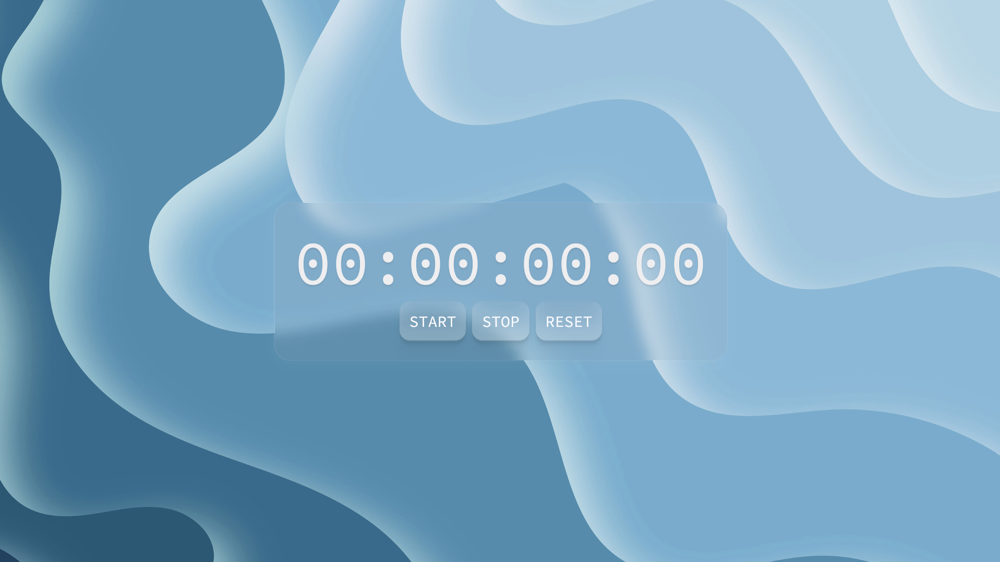

# StopWatch

Acesta face parte din suita de proiecte oferite de tutorialul lui BroCode pe care il puteti vedea si voi [aici](https://www.youtube.com/watch?v=lfmg-EJ8gm4&t=23378s).
 
Live demo @ [stopwatch.drincdalin.online](stopwatch.drincdalin.online).
 
M-am chinuit enorm de mult cu UI-ul pentru a incerca ceva relativ nou (<b>Frutiger Aero</b>).

## Ce este?
<ul>
  <li>Un Stopwatch simplu la ce te asteptai</li>
  <li>Este si putin AI slop la final care a bagat un event listener pt keyboard controls (sunt gatit acuma urma sa ajung la asta in tutorial)</li>
</ul>

## In ce e facut?
<ul>
  <li>HTML</li>
  <li>CSS</li>
  <li>Js Vanilla</li>
  <li>Nu stiu altceva</li>
</ul>

## Cum il folosesti?
<ul>
  <li>Apesi <kbd>spacebar</kbd> pentru a da start (sau <b>apesi pe buton</b>)</li>
  <li>Apesi <kbd>T</kbd> || <kbd>spacebar</kbd> pentru a da stop (sau <b>apesi pe buton</b>)</li>
  <li>Apesi <kbd>R</kbd> pentru a da restart (sau <b>apesi pe buton</b>)</li>
</ul>

## Hope you enjoy!
